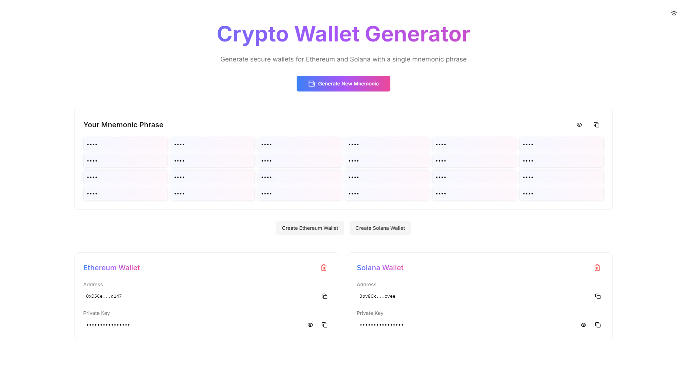

# Cryptura - Crypto Wallet Generator

Cryptura is a web-based crypto wallet generator built using Next.js, React 18, Tailwind CSS, Aceternity UI, and shadcn UI. It allows users to generate secure Ethereum and Solana wallets from a single mnemonic phrase, with functionality to copy, hide, and manage wallets efficiently.

## Features

### 🔥 Hero Section

- A button to Generate New Mnemonic, ensuring secure wallet creation.
- Displays the mnemonic phrase with the following options:
  - Copy Functionality: Easily copy the mnemonic to the clipboard.
  - Hide/Reveal Functionality: Toggle visibility of the mnemonic.

### 🌐 Wallet Management

- Ethereum Wallets:

  - Create Ethereum wallets with unique addresses and private keys.
  - Display wallet details with hover animations.
  - Copy wallet details or delete wallets.

- Solana Wallets:
  - Create Solana wallets with unique addresses and private keys.
  - Display wallet details with hover animations.
  - Copy wallet details or delete wallets.
  - Support for creating multiple wallets for both Ethereum and Solana.

### 🎨 Design

- Dark Theme: The app comes with a sleek dark theme by default.
- Microinteractions: Smooth animations for buttons, hover effects, and wallet card actions.
- Responsive UI: Fully responsive design, ensuring compatibility with both desktop and mobile devices.

## Technologies Used

- Framework: Next.js with React 18.
- Styling: Tailwind CSS for flexible and responsive design.
- UI Components:
  - shadcn UI for composable UI utilities.
- Wallet Libraries:
  - Ethereum: Using ethers.js.
  - Solana: Using @solana/web3.js.

## Future Enhancements

- Add support for additional blockchain wallets (e.g., Bitcoin, Polygon).
- Include password-protected wallets for enhanced security.
- Add persistent storage for wallets using local storage or a database.

## Screenshots

